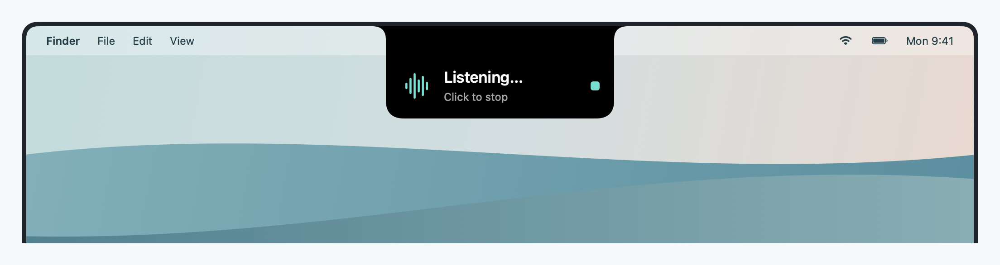
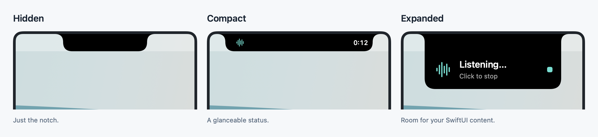
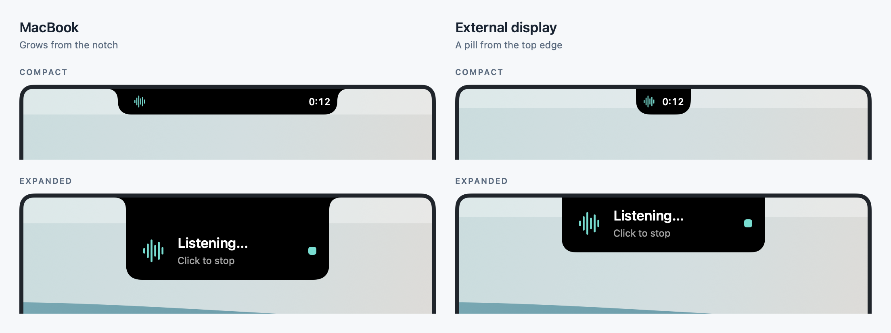

# DynamicLanding

<picture>
  <source media="(prefers-color-scheme: dark)" srcset="Docs/Images/hero-dark.png">
  
</picture>

**A Dynamic Island for macOS apps, in SwiftUI.**

DynamicLanding puts a small black island at the top of the screen — the way iOS shows a timer, a
call or a recording — and lets your Mac app put any SwiftUI view inside it. On a MacBook it grows
out of the notch, as if the notch itself were expanding. On a display without a notch it hangs
from the top edge of the screen as a rounded pill. Either way it always grows *downward from the
top*, centred on the screen, and never inflates from its own middle.

It was built for [JustScribe](https://justscribe.quassum.com), a dictation app, to show
"listening…" while you speak. It suits anything that deserves a glanceable status at the top of
the screen: timers, recordings, uploads, now playing, a call, a build.

<picture>
  <source media="(prefers-color-scheme: dark)" srcset="Docs/Images/states-dark.png">
  
</picture>

- **Three states**: hidden, compact (a leading and a trailing view beside the notch, like iOS Live
  Activities) and expanded (rich content of any size).
- **Notch-aware**: flush with the notch on MacBooks, a pill hanging from the top edge on other
  displays — or force either look.
- **Always top-anchored**: every animation keeps the top edge pinned and the island centred. This
  is enforced by tested geometry, not by animation tweaks.
- **Morphs in place**: compact → expanded reshapes the same island; updating content in the same
  state (a ticking clock) changes it without a flicker.
- **Stays out of the way**: never takes keyboard focus, never steals clicks outside the island,
  appears on every Space and above full-screen apps.
- **Shares the notch**: when another app's island shows, the one that matters less hides and
  comes back by itself afterwards. Priorities decide; no setup, no helper process.
- **Plain by default**: black, no shadow, no bounce. Colours, corner radii, padding, shadow and
  animation are all configurable.
- **No dependencies.** macOS 14 or later. MIT licence.

<picture>
  <source media="(prefers-color-scheme: dark)" srcset="Docs/Images/displays-dark.png">
  
</picture>

## Installation

In Xcode: **File → Add Package Dependencies…** and enter

```
https://github.com/bring-shrubbery/dynamic-landing
```

Or in `Package.swift`:

```swift
dependencies: [
    .package(url: "https://github.com/bring-shrubbery/dynamic-landing", from: "0.2.2"),
],
targets: [
    .target(name: "MyApp", dependencies: [.product(name: "DynamicLanding", package: "dynamic-landing")]),
]
```

DynamicLanding is pre-1.0: minor versions (0.2, 0.3…) may change the API. Use
`.upToNextMinor(from: "0.2.0")` to opt in to those explicitly.

## Quick start

```swift
import DynamicLanding
import SwiftUI

@MainActor
final class RecordingIndicator {
    private let island = DynamicLanding()           // black, notch-aware, no shadow

    func recordingStarted() async {
        // Compact: a small view on each side of the notch.
        await island.show(
            compactLeading: { Image(systemName: "waveform") },
            trailing: { Text("0:00").monospacedDigit() }
        )
    }

    func recordingStopped() async {
        // Expanded: any SwiftUI view. The compact island morphs into it.
        await island.show(expanded: {
            Label("Saved to Notes", systemImage: "checkmark.circle.fill")
        })
        try? await Task.sleep(for: .seconds(2))
        await island.hide()
    }
}
```

`DynamicLanding` is `@MainActor`: call it from a SwiftUI view, an app delegate or any other
main-actor code.

### Updating live content

Call `show` again in the same state to change what it shows. The island keeps its identity, so the
text changes without a crossfade — ideal for a clock:

```swift
for second in 1... {
    try await Task.sleep(for: .seconds(1))
    await island.show(compactLeading: { Image(systemName: "waveform") },
                      trailing: { Text(String(format: "%d:%02d", second / 60, second % 60)).monospacedDigit() })
}
```

Use `.monospacedDigit()` for numbers so the island doesn't change width every second.

### Taps

```swift
island.onTap = { [weak self] in self?.stopRecording() }
```

`onTap` fires for a click anywhere on the island. Buttons inside your content work as usual and
take precedence. Clicks outside the island go to whatever is underneath, including the menu bar.

## Sharing the notch with other apps

Every island takes part in an agreement with every other DynamicLanding island on the machine,
in this app or any other: one island per display at a time. When a second one shows, the one
that matters less hides at once and keeps its content; when the winner hides, the loser shows
itself again. Nothing to set up.

```swift
var config = IslandConfiguration()
config.priority = .urgent              // a prompt; holds the notch against a timer
let island = DynamicLanding(configuration: config)

island.onYield = { timer.pause() }     // another island took the notch; this one has hidden
island.onResume = { timer.resume() }   // the notch is free; this one is showing again
```

Priorities are `.background`, `.normal` (the default), `.high` and `.urgent`, or any integer. A
higher priority wins; between equals the island shown last wins. `isYielded` says whether the
island is waiting. `configuration.coordination = .none` opts out.

[Docs/Coordination.md](Docs/Coordination.md) has the agreement in full, with the message format,
so other implementations can join it.

## Configuration

```swift
var config = IslandConfiguration(style: .automatic)
config.shadow = .soft(radius: 10, opacity: 0.4)
config.animation = .snappy(duration: 0.3)
config.animationDuration = .milliseconds(300)   // keep in step with `animation`
config.hoverBehavior = [.keepVisible, .highlight]
let island = DynamicLanding(configuration: config)
```

| Property | Default | What it does |
|---|---|---|
| `style` | `.automatic` | `.automatic` (notch look on a notched screen, pill elsewhere), `.notch(topCornerRadius:bottomCornerRadius:)` or `.pill(cornerRadius:)` to force a look |
| `animation` | `.smooth(duration: 0.35)` | The SwiftUI animation for every change of shape |
| `animationDuration` | 350 ms | How long `show` and `hide` wait before returning; match it to `animation` |
| `shadow` | `.none` | `.soft(radius:opacity:)` adds a drop shadow |
| `background` | `.black` | `.color(_:)` for any colour, `.material(_:)` for a translucent material |
| `foreground` | `.white` | Default foreground style for your content |
| `contentPadding` | 10 · 16 · 12 · 16 | Space around expanded content (top, leading, bottom, trailing) |
| `compactHeight` | 32 pt | Height of the compact island on a screen without a notch, for an explicit `.pill` or `.notch` style (`.automatic` there matches the menu bar's height) |
| `expandedTopInset` | 8 pt | Space above expanded content on a screen without a notch |
| `notchCornerRadii` | top 15, bottom 20 | Corner radii of the notch look; the top corners flare into the menu bar |
| `pillCornerRadius` | 16 pt | Bottom corner radius of the pill look |
| `slotPadding` | 8 pt | Padding around each compact view |
| `virtualNotchWidth` | 180 pt | Notch width used when you force `.notch` on a screen without one |
| `hoverBehavior` | `[]` | `.keepVisible`: a `hide()` waits (up to 10 s) while the pointer is on the island. `.highlight`: the island brightens under the pointer |
| `coordination` | `.shared` | `.shared` takes part in the agreement with other islands; `.none` shows regardless |
| `priority` | `.normal` | How the island ranks against others wanting the same notch; see above |

You can change `island.configuration` at any time; it applies from the next change of state.

### Which screen

`DynamicLanding()` shows on the screen you are using: the one holding the frontmost app's
window, else the one under the pointer. While it is visible it follows you there when you switch
Space or app, and it shows on every Space, full-screen ones included. Pass
`DynamicLanding(screen: someScreen)` to pin it to one display. If displays are rearranged while
the island is visible, it moves with them.

## Behaviour you can rely on

- **The call made last wins.** `show` and `hide` take effect immediately and return when their
  animation has finished. A `show` cancels a `hide` in progress; a second `hide` waits for the one
  already running. So `Task { await island.show(…) }; Task { await island.hide() }` ends hidden.
- **One island per `DynamicLanding`.** Showing repeatedly reshapes the same window; it never opens
  a second one. Create one instance per indicator and keep a reference to it. Two instances in
  one app take part in the agreement like two apps would.
- **Content is released once the island has hidden**, so views inside it stop running.
- **Never more than half the screen.** Oversized content is clipped, never pushed off-screen.

## How it works

The heart of it is a pure function. `IslandGeometry.layout` takes the state, the screen (its frame
and notch), the style and the measured size of your content, and returns the island's rectangle,
its corner radii and where each compact view or the expanded content goes. Its tests check, for
every state and style on notched and notchless screens, that the island's top edge is the screen's
top edge and that it is centred — the two properties that make it grow down from the top instead
of from its middle.

A SwiftUI view, top-aligned at every level, draws the island from that layout. It lives in a
borderless, non-activating panel pinned to the top of the screen, above the menu bar. The panel
ignores the mouse everywhere except over the island, and re-checks that whenever the island
changes shape and as the pointer moves.

## Demo

```
git clone https://github.com/bring-shrubbery/dynamic-landing
cd dynamic-landing
swift run DynamicLandingDemo
```

A menu-bar icon appears. Its menu shows the compact island with a ticking timer (⌘1) or the
expanded card (⌘2), hides it (⌘0), switches between the automatic, notch and pill styles, and
toggles the shadow. Click the island to hide it. "Interrupt with an urgent island" (⌘3) shows a
second, urgent island for three seconds: the timer yields to it and comes back afterwards, which
is what another app's island does. Run two copies of the demo to see it across processes.

## Requirements

- macOS 14 Sonoma or later
- A Swift 6 toolchain (Xcode 16 or later). The package builds in the Swift 5 language mode, so it
  works in both Swift 5 and Swift 6 projects.

## Limitations

- macOS only.
- One island per instance. Several islands that opt out of coordination on the same screen overlap.
- `.material` currently always renders the ultra-thin material.
- While visible, the island covers whatever menu-bar items are behind it.

## Contributing

Issues and pull requests are welcome. Run `swift test` before sending a change; a layout change
should come with a geometry test that pins the new behaviour.

Regenerate the README images on macOS with the package's Swift toolchain:

```sh
zsh Scripts/generate-readme-images.sh
```

The script compiles the unchanged library sources alongside a documentation-only renderer,
giving it internal access without adding a package target or public API. SwiftUI `ImageRenderer`
renders the real `IslandView` at 2× with synthetic notched and notchless screen metrics; the
wallpaper and menu bar are procedural. The six light/dark PNGs are saved in `Docs/Images/`, each
under 1 MB. Review them after regenerating; fonts and symbols can vary between macOS versions.

## Licence

MIT © 2026 Quassum MB. See [LICENSE](LICENSE).
